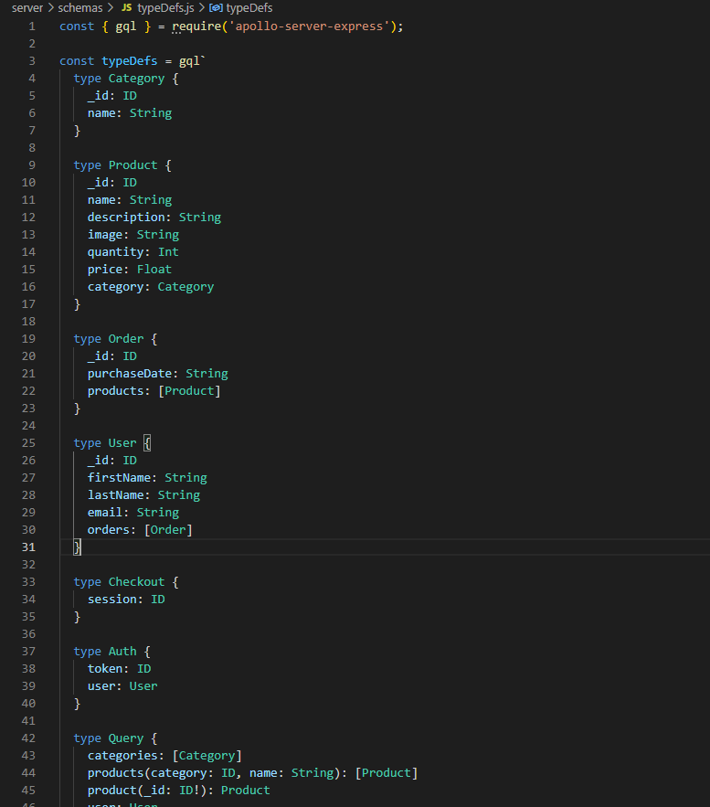
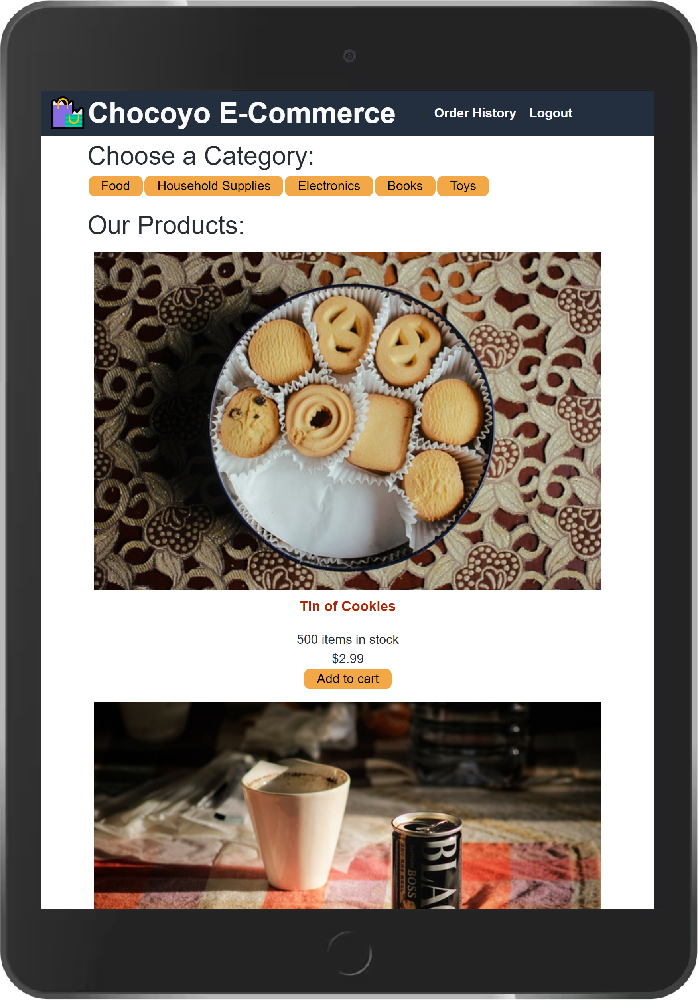
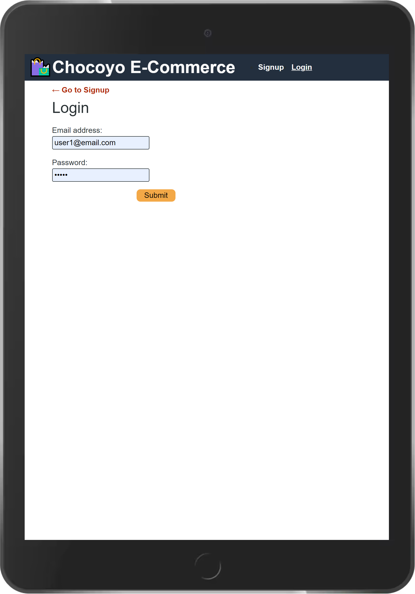
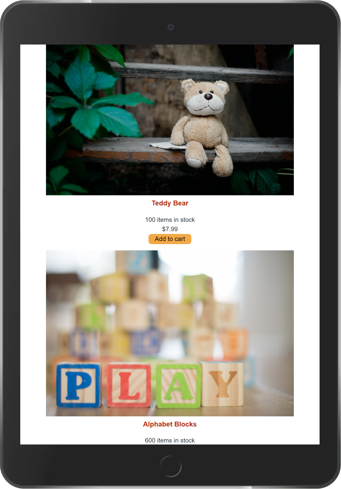
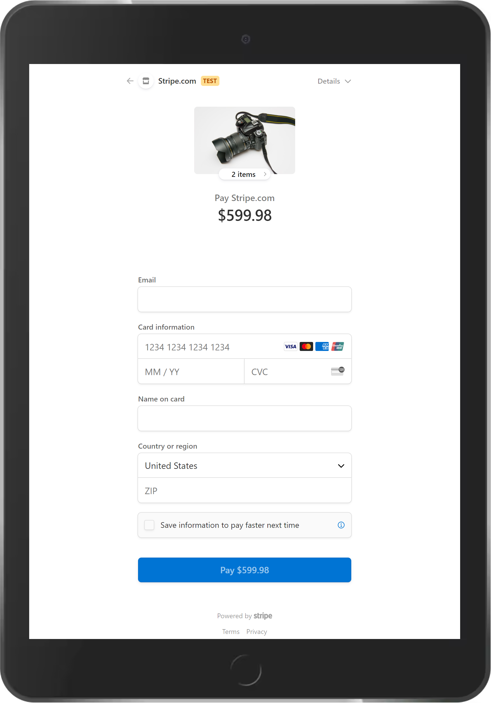

# Unit 22: Redux Store

## Task

This is a fully functioning **E-Commerce** application refactored from using **React's Context API** to **Redux**. The application runs a **GraphQL API** on an [Apollo Server](https://www.apollographql.com/). It allows users to search for products by category, save the products to a shopping cart, and finally, it allows to perform the **checkout** by calling the **Stripe API** with a demo key. The application was built using the **MERN** (_Mongo_, _Express_, _React_, and _Node_) Stack with a **React** front end, **MongoDB** database, and **NodeJS** and **ExpressJS** server and API.

## User Story

```md
AS a senior engineer working on an e-commerce platform
I WANT my platform to use Redux to manage global state instead of the Context API
SO THAT my website's state management is taken out of the React ecosystem
```

## Acceptance Criteria

```md
GIVEN an e-commerce platform that uses Redux to manage global state
WHEN I review the app’s store
THEN I find that the app uses a Redux store instead of the Context API
WHEN I review the way the React front end accesses the store
THEN I find that the app uses a Redux provider
WHEN I review the way the app determines changes to its global state
THEN I find that the app passes reducers to a Redux store instead of using the Context API
WHEN I review the way the app extracts state data from the store
THEN I find that the app uses Redux instead of the Context API
WHEN I review the way the app dispatches actions
THEN I find that the app uses Redux instead of the Context API
```

## Implementation

- [Features](#features)
- [Installation](#installation)
- [Usage](#usage)
- [License](#license)

## Features

On the technical architecture, the application features the use of **React** and **Redux** to handle a responsive, stateful user interface; **GraphQL** for data query and manipulation through APIs; **Apollo Server**, a GraphQL Server that can use data from disparate sources; **Apollo Client**, a state management library to manage GraphQL operations; **Mongoose** and **MongoDB** to define the logical structure of the database and provide a means to manage the underlying data structures; **HTML**, **Bootstrap**, and **Javascript** to enable the input and client-side validation of the application data; **Express.Js** for route handling and file serving, and **Node.Js** for Javascript running. The application also features the use of a payment system through **Stripe API**.

The application uses three schemas hosted on the **NoSQL** database (**MongoDb**), which are accessed through **APIs** built on **GraphQL**: _Categories_, _Products_, _Orders_, _Users_, _Auth_, and _Checkout_ as shown below:



Functionally, the application allows users to perform the following CRUD operations:

- View users, categories, products, and shopping cart through a fully functional **React/Redux** application
- Add products to the **shopping cart** for future checkout
- Update products currently in the shopping cart
- Remove products from the shopping cart
- Checkout orders through the use of a well-known payment system, **Stripe**
- Login existing users through a token-based authentication mechanism
- Sign up new users with immediate sign in to the application









## Installation

The application requires [Node.Js](https://nodejs.org/en/) Runtime Library, [Express.js](https://www.npmjs.com/package/express), [Mongoose](https://www.npmjs.com/package/mongoose) libraries, along with a running _local_ instance of [MongoDb](https://www.mongodb.com/), or a _cloud_ instance of **MongoDb** known as [Atlas](https://www.mongodb.com/cloud/atlas), [React](https://www.npmjs.com/package/react), [Apollo Server](https://www.npmjs.com/package/apollo-server), [Apollo Client](https://www.npmjs.com/package/@apollo/client), and [GraphQL](https://www.npmjs.com/package/graphql), as well as [Stripe API](https://www.npmjs.com/package/stripe).

A JSON file containing these dependencies is included with this project. To set up the development environment for the application, simply run the following command:

```bash
npm run install
```

Next, execute the following command to seed the database with sample data:

```bash
npm run seed
```

Once the database is seeded, run the following command to start the application:

```bash
npm run develop
```

## Usage

The application has been coded with a _mobile first_ approach in mind. It allows users to perform CRUD operations against a live **MongoDb** database using the following HTTP methods for REST APIs: _GET_, _POST_, _PUT_, and _DELETE_. If you want to run the application in your development environment, make sure to follow the [Installation](#installation) instructions above; otherwise, the application has been deployed to [Heroku](https://ku-cbc-e-commerce.herokuapp.com/) through a **CI/CD** pipeline, which also connects to a live **MongoDb Atlas** database.

## License

This project is licensed under The MIT License. Refer to https://opensource.org/licenses/MIT for more information of what you can and cannot do with this project. See contact information below if you have questions, comments, or suggestions for the project.

## Contributing Guidelines

Want to contribute to this project? You may clone or fork the project in GitHub. Note the licesing information referred in this file.

## Contact Information

For questions, comments, or suggestions, please contact me by E-Mail:

japinell@yahoo.com

Check out my other **cool** projects in GitHub - https://github.com/japinell

## License

This application is licensed under the following license:

[](https://opensource.org/licenses/MIT)(https://opensource.org/licenses/MIT)
